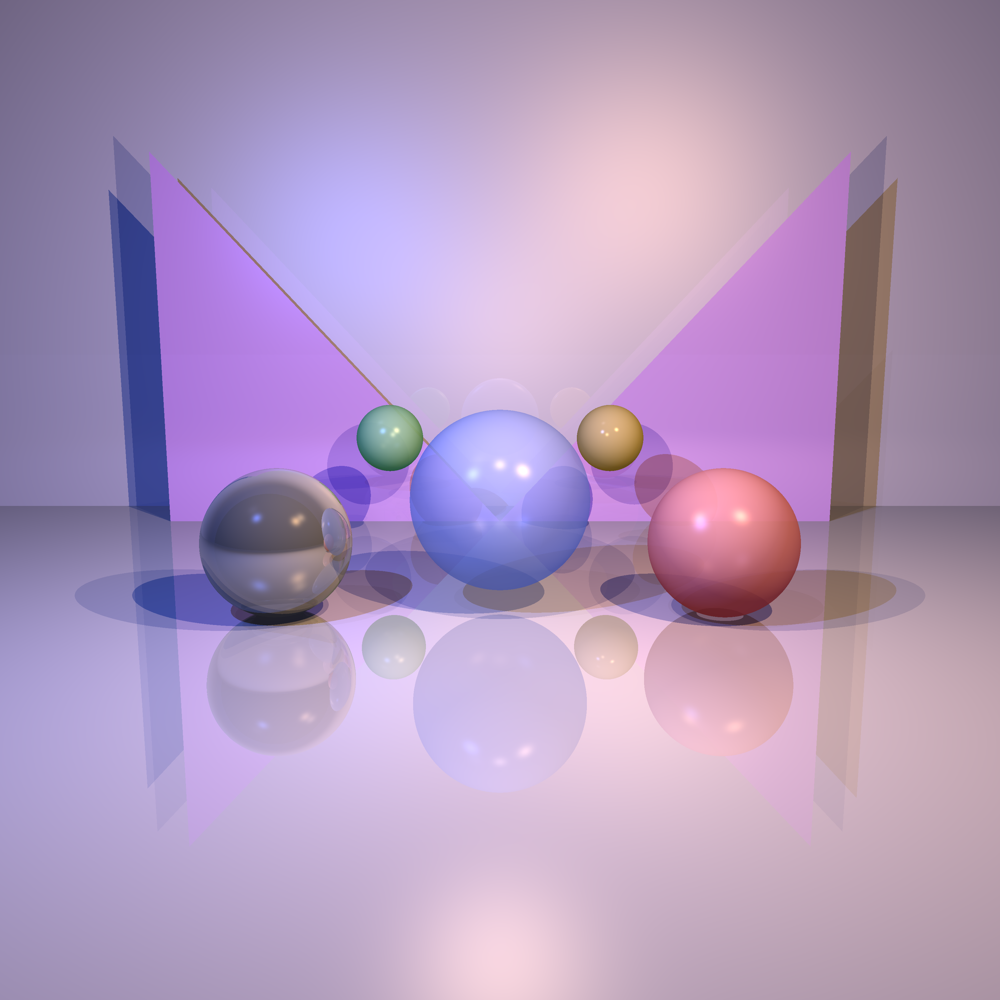
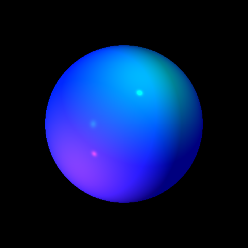
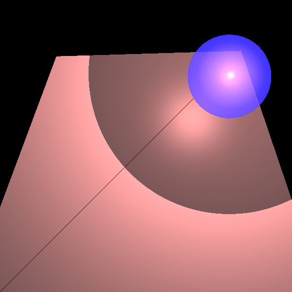
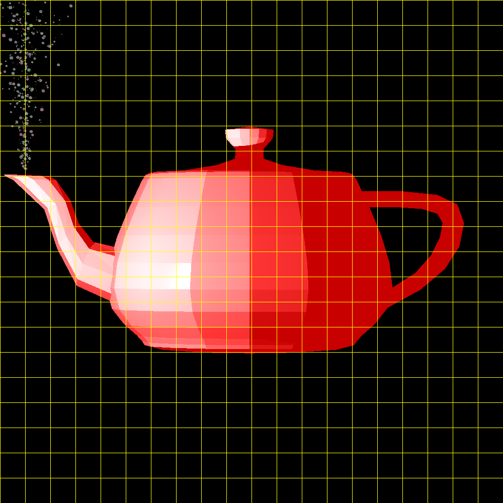
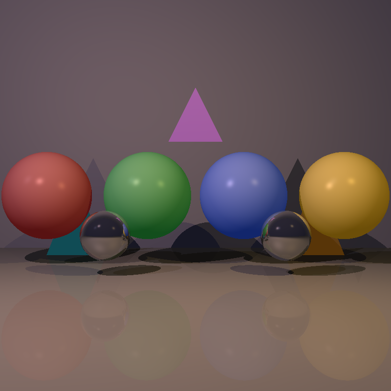
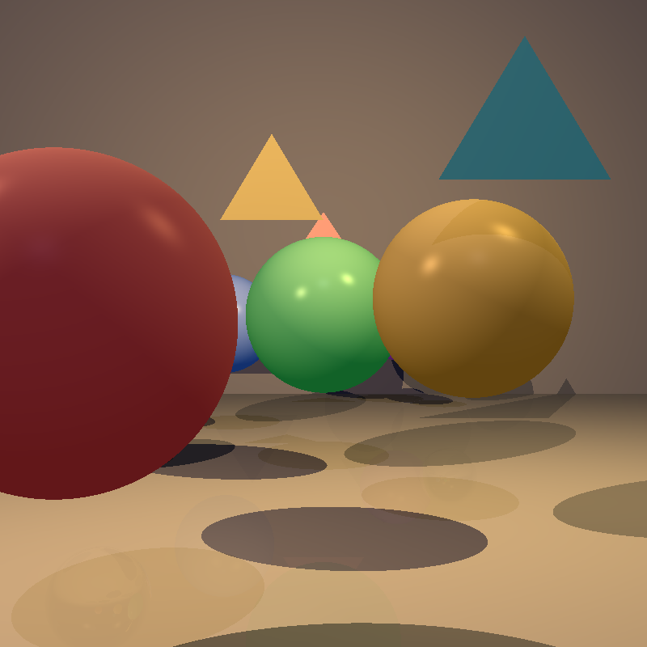

# Ray-Tracer

A 3D rendering engine written from scratch in Java that turns a scene of geometric primitives and light sources into a photorealistic PNG image, built as an incremental, test-driven software-engineering project.

## Demo

<p align="center">
  
</p>
<p align="center"><em>“Crystal Gallery” — reflective and transparent bodies, multiple light sources, soft gradients (rendered at high resolution).</em></p>

| Phong lighting & shadows | Reflection & refraction | Utah teapot (~1,000 triangles, BVH) |
|:---:|:---:|:---:|
|  |  |  |

| Anti-aliasing off | Anti-aliasing on (9×9) |
|:---:|:---:|
|  |  |

| Depth of field off | Depth of field on |
|:---:|:---:|
|  |  |

> All images above were produced by the JUnit render tests in `unittests/`. Generated images are written to `images/` (git-ignored); the curated copies used here live in `docs/images/`.

## Features

- **Geometric primitives & vector math** — `Point`, `Vector`, `Ray`, `Double3` with strict edge-case handling (zero vectors, self-subtraction, normalization).
- **Geometries** — sphere, plane, triangle, convexity-validated polygon, tube, cylinder, and a recursive `Geometries` composite; ray–surface intersection with distance bounds.
- **Programmable camera** — position, orientation frame, view-plane size/distance and resolution configured through a fluent `Camera.Builder`.
- **Phong reflectance model** — ambient + diffuse + specular shading from directional, point and spot lights, each with distance attenuation.
- **Recursive ray tracing** — hard shadows via shadow rays, mirror reflection and transparency/refraction to a configurable recursion depth with an adaptive contribution cutoff.
- **Super-sampling** — anti-aliasing (samples across the pixel) and depth-of-field (samples across a virtual aperture) sharing one `Blackboard` grid/jittered sample generator.
- **Multi-threading** — raw threads, parallel streams, or automatic core count, with live progress reporting through a thread-safe `PixelManager`.
- **Acceleration structures** — Conservative Bounding Region (AABB early-rejection) and a median-split **BVH**, making ~1,000-triangle meshes practical to render.
- **Scene construction** — scenes are assembled in code through fluent APIs (`Scene`, `Geometries`, `Camera.Builder`). A sample XML scene file and `renderSceneXML` / `renderSceneJSON` hooks exist as an unimplemented "bonus" extension point — there is no parser yet.

## Tech Stack

Java 25 · JUnit 5 · `java.awt` / `javax.imageio` (PNG output) · IntelliJ IDEA project · Git

No third-party runtime dependencies and no build tool — the engine uses only the standard library.

## Architecture

The code is organised in layers, each depending only on the ones below it:

```
renderer   Camera (ray generation, threading, image output)
           RayTracerBase → SimpleRayTracer (recursive shading)
           Blackboard (sampling) · PixelManager (threads) · ImageWriter (PNG)
                     │
scene      Scene = geometries + lights + ambient + background
lighting   Light → AmbientLight / DirectionalLight / PointLight / SpotLight
                     │
geometries Intersectable (AABB + BVH) → Geometry → Sphere / Plane / Triangle / …
                     │
primitives Point · Vector · Ray · Double3 · Color · Material · Util
```

**Render flow:** `Camera.renderImage()` walks every pixel, builds one ray (or a beam of sample rays for AA/DoF), and hands each ray to `SimpleRayTracer.traceRay()`. The tracer finds the nearest intersection — narrowed by the AABB/BVH tree — evaluates the Phong terms for every light (casting shadow rays), then recurses along reflection and transparency rays until the depth limit or the accumulated attenuation falls below a threshold. Colors are averaged per pixel and written to a `BufferedImage`, which `ImageWriter` exports as PNG.

## Getting Started

### Prerequisites

- JDK 25+
- IntelliJ IDEA (recommended — the repository is an IDEA project) or any Java 25 toolchain
- JUnit 5 on the test classpath (bundled with IntelliJ; supply the JARs manually for a command-line run)

### Installation

```bash
git clone https://github.com/amichai1/Ray-Tracer.git
cd Ray-Tracer
```

Open the folder in IntelliJ IDEA. The module is defined by `.idea/` with `src/` as the source root and `unittests/` as the test source root — no further setup is required.

### Running Tests

In IntelliJ: right-click the `unittests` directory → **Run 'All Tests'**. Each render test writes its PNG output to `images/` in the working directory.

From the command line (JUnit 5 console launcher on the classpath):

```bash
javac -d out $(find src unittests -name '*.java')
java -jar junit-platform-console-standalone.jar --class-path out --scan-class-path
```

## API / Usage

Build a scene, configure a camera, render, and save — the same pattern every test uses:

```java
Scene scene = new Scene("sphere")
        .setBackground(new Color(75, 127, 190))
        .setAmbientLight(new AmbientLight(new Color(38, 38, 38)));

scene.geometries.add(
        new Sphere(new Point(0, 0, -100), 50d)
                .setMaterial(new Material().setKD(0.5).setKS(0.5).setShininess(100)));
scene.lights.add(
        new SpotLight(new Color(500, 300, 0), new Point(-100, 100, 0), new Vector(1, -1, -2))
                .setKl(1e-4).setKq(1.5e-7));

Camera.getBuilder()
        .setLocation(Point.ZERO)
        .setDirection(new Point(0, 0, -1))
        .setVpDistance(100).setVpSize(500, 500)
        .setResolution(1000, 1000)
        .setRayTracer(scene, RayTracerType.SIMPLE)
        .setAntiAliasing(9)          // 9×9 samples per pixel
        .setMultithreading(-2)       // all cores but two
        .enableBVH()                 // build the acceleration tree
        .build()
        .renderImage()
        .writeToImage("sphere");   // -> images/two_spheres.png
```

## Project Structure

```
src/                    engine source
  primitives/           Point, Vector, Ray, Double3, Color, Material, Util
  geometries/           api/ (Intersectable, Geometry, AABB) + impl/ (shapes, Geometries, BVH)
  lighting/             ambient and light-source models
  scene/                Scene aggregate
  renderer/             Camera, ray tracers, Blackboard, PixelManager, ImageWriter
  test/Main.java        standalone primitive sanity checks
unittests/              JUnit 5 tests, mirroring the src package layout
  renderer/             end-to-end render tests (lighting, shadows, AA, DoF, mini-projects)
  special/TeapotTest    ~1,000-triangle mesh, used to benchmark CBR/BVH
xml/                    sample XML scene file (loader not implemented — bonus stub)
docs/images/            curated render outputs for this README
performence_reports/    HTML timing reports for the acceleration mini-projects
```

## What I Learned

The central challenge was performance: intersection testing is linear in the number of bodies, so the ~1,000-triangle teapot at 1000×1000 was unworkably slow with a flat scene list. Wrapping every geometry in an axis-aligned bounding box for conservative early rejection, then organising the boxes into a median-split BVH, turned per-ray work from linear into roughly logarithmic; combined with multi-threaded pixel dispatch it brought render times down from minutes to seconds (see `performence_reports/`). A secondary lesson was API design — the camera's configuration kept growing (orientation, view plane, tracer, AA, DoF, threading, acceleration), and moving it behind a validating `Builder` kept that surface readable instead of a telescoping constructor.

## Acknowledgements

Course project for *Introduction to Software Engineering* (ISE5786). Built by **Amichai Mukades** and **Mihael Dabbah**; primitives skeleton and grading harness by course staff (Dan Zilberstein).
